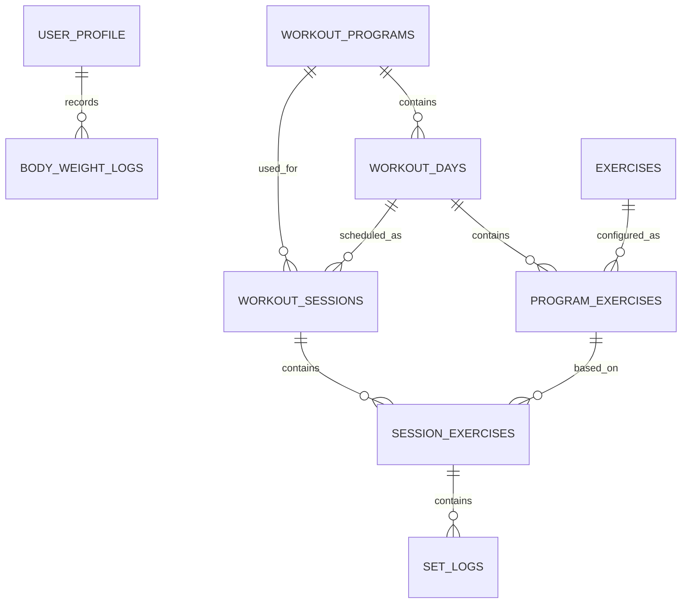

# GainIt — Local-First Hypertrophy Tracker

> Working title: **GainIt**  
> Platform: Flutter / Android-first, iOS-ready  
> Product strategy: **Local-first MVP → smart progression → cloud sync/backend → optional account & multi-device**

---

## 1. Product Idea

GainIt is a personal hypertrophy/workout tracker built around one important idea:

> The app should not only tell the user what workout to do; it should remember what happened last time, calculate progress, and tell the user what to do next.

The first version is intentionally **offline/local-first**. The user can open the app, see the program, train, record every set, view history, and get progression recommendations without creating an account or depending on a backend.

The architecture must make the later transition to cloud sync possible without rebuilding the UI or the workout/business logic.

### Main value proposition

1. Follow the weekly hypertrophy program.
2. Log weight, reps and RIR for every working set.
3. Track progression exercise by exercise.
4. Automatically calculate weekly volume.
5. Give a clear next-session target using the program's progression rules.
6. Track body-weight progress.
7. Keep everything available offline.

---

# 2. Program Specification — Source of Truth

The uploaded hypertrophy PDF is the source of truth for the initial program configuration.

### Weekly schedule

| Day | Session |
|---|---|
| Saturday | Rest |
| Sunday | Chest + Back + Traps |
| Monday | Legs |
| Tuesday | Rest |
| Wednesday | Upper + Side Delts + Forearms |
| Thursday | Shoulders + Arms |
| Friday | Rest |

### Sunday — Chest + Back + Traps

19 working sets:

| Exercise | Sets | Rep Range | Rest |
|---|---:|---:|---:|
| Flat Barbell Bench Press | 3 | 6–10 | 2–3 min |
| Wide Barbell Row | 3 | 6–10 | 2–3 min |
| Incline Bench Press | 3 | 8–12 | 2 min |
| Lat Pulldown | 3 | 8–12 | 2 min |
| Pec Fly | 2 | 12–15 | 1–1.5 min |
| Seated Cable Row | 2 | 10–12 | 1.5 min |
| Dumbbell Shrugs | 3 | 10–15 | 1–1.5 min |

The source intentionally alternates chest and back exercises to let one muscle group recover while the opposite group works.

### Monday — Legs

20 working sets:

| Exercise | Sets | Rep Range | Rest |
|---|---:|---:|---:|
| Squat / Hack Squat | 4 | 6–10 | 3 min |
| Lying Leg Curl | 4 | 10–15 | 1.5 min |
| Leg Press | 3 | 10–15 | 2 min |
| 45° Back Extension | 3 | 10–15 | 1.5 min |
| Leg Extension | 2 | 12–15 | 1.5 min |
| Standing Calf Raise | 4 | 10–15 | 1–1.5 min |

The source currently uses the 45° back extension instead of RDL, with a future option to try a light dumbbell RDL after 4–6 weeks.

### Wednesday — Upper + Side Delts + Forearms

18 working sets:

| Exercise | Sets | Rep Range | Rest |
|---|---:|---:|---:|
| Flat Dumbbell Bench Press | 3 | 8–12 | 2 min |
| High Cable Pulldown | 3 | 10–12 | 2 min |
| Cable Fly | 2 | 12–15 | 1–1.5 min |
| Row / Width Exercise | 2 | 10–12 | 1.5 min |
| Cable Lateral Raise | 4 | 12–20 | 1 min |
| Wrist Curl | 2 | 15–20 | 1 min |
| Reverse Wrist Curl | 2 | 15–20 | 1 min |

No direct biceps/triceps work is placed here so Thursday starts fresher.

### Thursday — Shoulders + Arms

22 working sets:

| Exercise | Sets | Rep Range | Rest |
|---|---:|---:|---:|
| Dumbbell Lateral Raise | 4 | 12–20 | 1 min |
| Cable Rear-Delt Rope | 3 | 12–20 | 1 min |
| Machine Front Raise / Front Delt Exercise | 3 | 8–12 | 2 min |
| Overhead Triceps Extension | 3 | 8–12 | — |
| Incline Dumbbell Curl | 3 | 8–12 | 1.5 min |
| Straight-Bar Triceps Pushdown | 3 | 10–15 | — |
| Hammer Curl | 3 | 10–12 | 1.5 min |

The source uses a biceps/triceps superset to reduce session time.

### Training rules from the source

- 2–3 light warm-up sets before compound exercises; warm-ups are not counted as working sets.
- Compounds: generally keep 1–3 reps in reserve.
- Isolation: generally 0–2 reps in reserve on the final set.
- Rep ranges are practical ranges, not magical limits.
- Longer rest periods are preferred for heavy compounds.
- Double progression is the selected progression method.
- Increase weight when the upper end of the rep range is reached in all working sets.
- If one exercise stalls for 2–3 sessions, reduce the load by about 10% and rebuild.
- If multiple exercises stall together, inspect recovery factors before changing the program.
- If performance is broadly falling because of accumulated fatigue, use a lighter week with approximately half the normal working-set volume.

### Initial weekly direct volume

| Muscle | Direct sets |
|---|---:|
| Chest | 13 |
| Back | 13 |
| Quads | 9 |
| Hamstrings | 7 |
| Calves | 4 |
| Side delts | 8 |
| Rear delts | 3 + pulling work |
| Biceps | 6 + indirect pulling work |
| Triceps | 6 + indirect pressing work |
| Traps | 3 + pulling/rowing work |
| Forearms | 4 + grip/hammer work |

These values are initial program data, not hard-coded UI text. The app should calculate them from exercise-to-muscle mappings.

---

# 3. Product Principles

## 3.1 Local-first

All critical actions must work without internet:

- Open app.
- View schedule.
- Start workout.
- Log sets.
- Run rest timer.
- Save workout.
- View history.
- Calculate progression.
- View progress charts.

## 3.2 Single source of truth

The database is the source of truth for persistent data.

UI state is transient and should not become a second database.

## 3.3 Business rules are not inside widgets

Widgets display state and send user actions.

Progression, volume calculations, deload detection, and workout recommendations live outside the UI.

## 3.4 Configuration over hard-coding

Exercises, rep ranges, set counts, rest times and progression rules should be stored as program data.

That allows a future program editor without rewriting the workout screen.

## 3.5 Build the MVP small, but architect for growth

Do not start with:

- Authentication.
- Backend APIs.
- Social feed.
- AI coach.
- Nutrition database.
- Wearables.
- Complex subscription features.

Those can come after the local tracking loop works well.

---

# 4. MVP Feature Set

## Must-have

### A. Onboarding

Collect only what is useful initially:

- Name / nickname.
- Height.
- Current weight.
- Goal: gain muscle / maintain / cut.
- Training start date.
- Unit system: kg + cm initially.

No login.

### B. Home Dashboard

The dashboard should answer four questions immediately:

1. What is my next workout?
2. What did I do last time?
3. How is my body weight changing?
4. Am I progressing?

Suggested structure:

```text
┌──────────────────────────────┐
│ Good evening, Tarek          │
│ Week 4 · Hypertrophy         │
├──────────────────────────────┤
│ NEXT WORKOUT                 │
│ Chest + Back + Traps         │
│ Sunday · 19 sets             │
│ [ Start Workout ]             │
├──────────────────────────────┤
│ BODY WEIGHT                  │
│ 72.4 kg     +0.4 kg / 2 wk   │
├──────────────────────────────┤
│ THIS WEEK                    │
│ ● 3/4 workouts               │
│ ● 46 working sets            │
├──────────────────────────────┤
│ LAST PROGRESS                │
│ Bench Press                  │
│ 30kg 10/9/8 → 30kg 11/10/9 │
└──────────────────────────────┘
```

### C. Plan

Display the weekly schedule with workout/rest states.

A workout card should show:

- Workout name.
- Number of exercises.
- Total working sets.
- Last completed date.
- Completion status.

### D. Workout Session

This is the core feature.

For every exercise:

- Exercise name.
- Target sets.
- Target reps.
- Rest time.
- Suggested starting weight.
- Suggested target reps.
- Previous session result.
- RIR target.
- Set logging controls.

Example:

```text
Bench Press
Target: 32.5 kg · 8–10 reps
Last:   30 kg · 12/12/12

Set 1   [32.5] kg   [ 8 ] reps   RIR [2]   ✓
Set 2   [32.5] kg   [ 8 ] reps   RIR [2]   ✓
Set 3   [32.5] kg   [ 9 ] reps   RIR [1]   ✓

        [ Start Rest Timer ]
```

### E. Rest Timer

The timer should understand the rest configured for the exercise.

Features:

- Start automatically after completing a set: optional setting.
- Pause.
- Skip.
- +15 sec.
- -15 sec.
- Sound/vibration at zero.
- Timer continues correctly if the UI rebuilds.

### F. Workout Summary

After the final set:

```text
Workout Complete

Chest + Back + Traps
19 working sets
52 min

Volume
Chest   13 sets
Back    13 sets
Traps    3 sets

Progress
✓ Bench Press +2 reps
✓ Incline Bench +1 rep
→ Row maintained

[ Finish ]
```

### G. History

Filters:

- All workouts.
- Muscle group.
- Exercise.
- Date range.

Each workout contains all logged sets and notes.

### H. Exercise Progress

When opening an exercise:

- Best weight.
- Best reps.
- Estimated 1RM (optional calculation).
- Recent sessions.
- Volume trend.
- Rep trend.

### I. Body Weight

Simple local log:

```text
Date        Weight
Sep 01      71.8 kg
Sep 08      72.1 kg
Sep 15      72.4 kg
Sep 22      72.5 kg
```

Chart: body weight over time.

---

# 5. Future Feature Roadmap

## Phase 1 — Local MVP

Goal: complete the entire offline workout loop.

- Onboarding.
- Program schedule.
- Workout execution.
- Set logging.
- Rest timer.
- History.
- Exercise progress.
- Body weight.
- Local notifications.
- Database migrations.
- Unit/widget tests.

## Phase 2 — Smart Training

- Double progression engine.
- Automatic next-weight recommendation.
- Weekly muscle-volume dashboard.
- Plateau detection.
- Fatigue indicator.
- Deload recommendation.
- Personal exercise notes.
- Exercise substitutions.
- Workout templates.

## Phase 3 — Personalization

- Multiple programs.
- Program builder.
- Re-order exercises.
- Change set/repetition targets.
- Custom progression rules.
- Custom rest periods.
- Exercise library.
- Custom exercises.

## Phase 4 — Cloud

Add:

- Authentication.
- Cloud profile.
- Remote database.
- Cloud backup.
- Multi-device sync.

The local database remains the first place the app reads/writes from.

## Phase 5 — Sync Architecture

Target flow:

```text
UI
 ↓
ViewModel / Notifier
 ↓
Repository
 ├── Local Data Source (Drift)
 └── Remote Data Source (API/Firebase/Supabase)

Repository decides:
- local read
- local write
- sync
- conflict resolution
```

Never make widgets talk directly to Firebase or REST endpoints.

## Phase 6 — Optional Premium Features

Potential later features:

- Advanced analytics.
- Custom programs.
- Cloud backup.
- Coach sharing.
- Export/import.
- PDF workout reports.
- Wearable integrations.
- Nutrition tracking.
- Optional AI-assisted insights.

AI is not part of the MVP and should only be added where it solves a real user problem.

---

# 6. Recommended Tech Stack

## Core

| Tool | Purpose |
|---|---|
| Flutter | Cross-platform mobile app |
| Dart | Application language |
| Material 3 | Base design system |
| Git + GitHub | Version control |
| GitHub Actions | CI |

## Architecture / State

| Tool | Purpose |
|---|---|
| Riverpod 3 | State management + dependency injection |
| Riverpod Generator | Generated providers when useful |
| GoRouter | Routing |
| Domain layer | Complex workout/progression logic only |

Flutter's current architecture guidance emphasizes separation of concerns, with UI and data layers and an optional domain/logic layer when client business logic becomes complex. That maps well to this app because progression and volume calculations are genuine business logic. citeturn286209search0turn286209search3

GoRouter is appropriate for declarative routes, nested navigation, redirects and future deep-link support. citeturn805957search0

## Local storage

### Primary database: Drift + SQLite

Recommended packages:

```yaml
dependencies:
  drift:
  drift_flutter:
  flutter_riverpod:
  go_router:
  fl_chart:
  flutter_local_notifications:
  intl:
  uuid:

dev_dependencies:
  drift_dev:
  build_runner:
  riverpod_generator:
  riverpod_lint:
```

Drift gives us:

- Type-safe database access.
- SQL/query builder support.
- Generated Dart types.
- Reactive query streams.
- Transactions.
- Migrations.
- DAO support.

Those properties fit a workout-history app better than storing the entire application state as JSON or unrelated key/value boxes. citeturn292588search0turn292588search3

For native applications, Drift's current native implementation uses SQLite through FFI, and the project recommends that approach for new projects. Its database can also run away from the UI isolate for heavier work. citeturn292588search5turn292588search6

### Small settings storage

Use a lightweight key/value store for very small preferences only, for example:

- Theme mode.
- Sound enabled.
- Vibration enabled.
- Auto-start timer.
- Units.

Do not store workout history there.

## Charts

Use `fl_chart` for:

- Body-weight line chart.
- Exercise performance trend.
- Weekly muscle volume.
- Optional strength trend.

`fl_chart` supports line, bar, pie, scatter and radar charts and is actively maintained. citeturn286209search4

## Notifications

Use `flutter_local_notifications` for local workout reminders and scheduled notifications. citeturn805957search12turn805957search13

## Testing

- `flutter_test` for unit/widget tests.
- Integration tests for the full workout flow.
- Database migration tests.
- Repository tests.
- Progression engine tests.

---

# 7. Recommended Architecture

Flutter-side architecture:

```text
┌───────────────────────────────────────────┐
│                  UI Layer                 │
│                                           │
│ Screens / Widgets                         │
│        ↓                                  │
│ Riverpod Notifiers / ViewModels           │
└─────────────────────┬─────────────────────┘
                      ↓
┌───────────────────────────────────────────┐
│             Domain / Logic                │
│                                           │
│ ProgressionEngine                         │
│ VolumeCalculator                           │
│ WorkoutRecommendationService              │
│ Fatigue / Deload Detector                 │
│ WorkoutSessionRules                        │
└─────────────────────┬─────────────────────┘
                      ↓
┌───────────────────────────────────────────┐
│                Data Layer                 │
│                                           │
│ Repositories                              │
│        ↓                                  │
│ Drift DAOs / Local Data Sources            │
└─────────────────────┬─────────────────────┘
                      ↓
┌───────────────────────────────────────────┐
│             SQLite Database               │
└───────────────────────────────────────────┘
```

### Rule

`Widget → Notifier → Repository → DAO/Database`

Never:

```text
Widget → Drift
Widget → SQL
Widget → ProgressionEngine directly
Widget → Future Firebase API
```

The UI should receive UI-ready state and send user actions to the state layer.

---

# 8. Feature-Based Folder Structure

Recommended structure:

```text
lib/
├── app/
│   ├── app.dart
│   ├── router/
│   └── theme/
│
├── core/
│   ├── database/
│   │   ├── app_database.dart
│   │   ├── tables/
│   │   ├── daos/
│   │   └── migrations/
│   ├── errors/
│   ├── extensions/
│   ├── constants/
│   └── utils/
│
├── features/
│   ├── onboarding/
│   │   ├── presentation/
│   │   ├── application/
│   │   └── data/
│   │
│   ├── home/
│   │   └── presentation/
│   │
│   ├── program/
│   │   ├── presentation/
│   │   ├── application/
│   │   └── data/
│   │
│   ├── workout/
│   │   ├── presentation/
│   │   ├── application/
│   │   └── data/
│   │
│   ├── history/
│   │   ├── presentation/
│   │   └── application/
│   │
│   ├── progress/
│   │   ├── presentation/
│   │   └── application/
│   │
│   ├── body_weight/
│   │   ├── presentation/
│   │   └── application/
│   │
│   └── settings/
│       ├── presentation/
│       └── application/
│
├── domain/
│   ├── progression/
│   ├── volume/
│   ├── fatigue/
│   └── workout_rules/
│
└── main.dart
```

### Important architectural decision

Not every feature needs a `domain` directory.

A simple settings screen does not need use cases just because the architecture diagram contains a domain layer.

The domain layer should exist where the business rules justify it.

---

# 9. Local Database Design

## 9.1 Tables

### `user_profile`

Stores local onboarding/profile data.

```text
id
name
height_cm
current_goal
training_start_date
created_at
updated_at
```

### `workout_programs`

Represents a complete program.

```text
id
name
description
is_active
start_date
created_at
updated_at
```

### `workout_days`

Represents the weekly schedule.

```text
id
program_id
weekday
name
type            // rest | workout
sort_order
```

### `exercises`

Master exercise library.

```text
id
name
muscle_primary
muscles_secondary
category        // compound | isolation
is_custom
created_at
```

### `program_exercises`

The most important configuration table.

```text
id
workout_day_id
exercise_id
order_index
working_sets
rep_min
rep_max
rest_min_seconds
rest_max_seconds
rir_min
rir_max
progression_type
weight_step
notes
```

This means the program can be changed without changing the Dart code.

### `workout_sessions`

One real training session.

```text
id
workout_day_id
program_id
started_at
completed_at
status          // in_progress | completed | abandoned
notes
```

### `session_exercises`

A snapshot/reference of exercises performed in the session.

```text
id
session_id
program_exercise_id
exercise_name_snapshot
order_index
```

The snapshot is useful because a future program edit should not destroy the historical meaning of an old workout.

### `set_logs`

Every working set gets a row.

```text
id
session_exercise_id
set_number
planned_reps_min
planned_reps_max
planned_weight
actual_weight
actual_reps
rir
completed_at
is_warmup
notes
```

Typo prevention note for implementation: the actual Dart/SQL field should be named `actual_weight`; `actual_weight` above is only a conceptual placeholder and must not be implemented.

### `body_weight_logs`

```text
id
weight_kg
measured_at
notes
```

### `app_settings`

```text
key
value
```

Use this only for small preferences.

---

# 10. Database Relationships



### Why this structure?

It separates:

- **Program definition** = what should happen.
- **Workout session** = what actually happened.
- **Set log** = exact performance.

This is essential for progression calculations.

---

# 11. Database Example

Example for Bench Press:

### Program definition

```text
program_exercises
-----------------
exercise: Flat Barbell Bench Press
sets: 3
rep_min: 6
rep_max: 10
rir_min: 1
rir_max: 3
rest: 120–180 sec
progression: double_progression
weight_step: 2.5kg
```

### Session #1

```text
30kg → 10
30kg → 9
30kg → 8
```

### Session #2

```text
30kg → 10
30kg → 10
30kg → 9
```

### Session #3

```text
30kg → 10
30kg → 10
30kg → 10
```

### Session #4

The progression engine sees that the upper bound was reached in all sets and recommends the next configured weight step.

```text
Suggested weight: 32.5kg
Target: 6–10 reps
```

The actual recommendation should always be generated from stored exercise configuration, not from a hard-coded `if exercise == bench press` condition.

---

# 12. Progression Engine

## Input

```text
Exercise configuration
+
Previous completed session
+
Current set performance
+
RIR target
+
Progression rule
```

## Output

```text
next_weight
next_rep_min
next_rep_max
message
recommendation_type
```

Example result:

```text
RecommendationType.increaseWeight

currentWeight = 30
suggestedWeight = 32.5
repRange = 6..10
reason = "All working sets reached the upper rep target."
```

## Double Progression algorithm

Pseudocode:

```text
if all working sets reach rep_max
    increase weight by configured weight_step
    target reps reset toward rep_min
else
    keep the same weight
    try to add reps next session
```

Do not mix recommendation logic with persistence.

Recommended separation:

```text
ProgressionEngine
    pure Dart
    no Flutter dependency
    no database dependency

ProgressionRepository
    reads/writes persistent data

WorkoutNotifier
    combines result with UI state
```

This makes the engine easy to unit-test.

---

# 13. Volume Engine

The application should calculate volume from actual session records rather than using fixed numbers.

Examples:

```text
Chest weekly direct sets
= completed sets for exercises mapped to chest
```

For indirect muscle contribution, keep the model explicit rather than silently guessing.

Possible future table:

```text
exercise_muscles
---------------
exercise_id
muscle_id
role            // primary | secondary
weight_factor   // optional future feature
```

For MVP, direct-set volume is enough. Indirect-set calculations can be added as a separate rule when the product needs them.

---

# 14. Workout State Machine

Workout execution should have explicit states.

```text
NotStarted
    ↓
InProgress
    ├── Pause / Resume timer
    ├── Complete set
    ├── Skip exercise
    └── Abandon workout
    ↓
Completed
```

A session should be saved incrementally.

Do NOT wait until the final "Finish Workout" button to write all sets to the database.

If the app crashes after set 10, the first 9 sets should still exist.

---

# 15. Workout UI Flow

```text
Splash
  ↓
Onboarding (first launch only)
  ↓
Home
  ├── Start next workout
  ├── View progress
  ├── Log body weight
  └── View history

Plan
  ↓
Workout Details
  ↓
Start Workout
  ↓
Exercise 1
  ↓
Set logging
  ↓
Rest Timer
  ↓
Next Set
  ↓
Next Exercise
  ↓
Workout Summary
  ↓
History / Progress
```

---

# 16. UI Structure

## Bottom Navigation

Recommended four destinations:

```text
Home     Plan     Progress     Profile
  🏠       📋        📈           ⚙
```

History can be reached from Home/Progress initially. If it becomes heavily used, it can become its own tab later.

## Home

Main goal: fast orientation.

Components:

- Greeting.
- Current body weight card.
- Next workout hero card.
- This-week completion.
- Recent progression.
- Quick weight log.

## Plan

Calendar/week representation.

A workout card should have visual distinction between:

- Completed.
- Today.
- Upcoming.
- Rest.

## Workout

Prioritize action over visual decoration.

Large:

- Exercise name.
- Suggested load.
- Rep range.
- Set controls.

Small/supporting:

- Previous result.
- Rest timer.
- Notes.

## Progress

Sections:

```text
Body Weight
   chart

Strength / Performance
   exercise selector
   chart

Weekly Volume
   muscle cards
```

## Profile / Settings

- User data.
- Units.
- Notifications.
- Timer settings.
- Theme.
- Export data.
- Delete local data.
- App version.

---

# 17. Visual Design Direction

The UI should feel like a **serious training tool**, not a generic social fitness app.

### Design characteristics

- Dark-first visual language.
- High contrast workout controls.
- Large numerical typography for weight/reps.
- Rounded cards, but not excessive.
- Minimal gradients.
- Clear status colors reserved for meaning.
- Strong primary CTA for starting/continuing workouts.
- Very little text during an active workout.

### Suggested palette

Use a restrained palette such as:

```text
Background      #0D0F12
Surface         #171A1F
Elevated        #20242B
Primary         #C8102E
Text            #F5F5F5
Muted Text      #9EA4AD
Success         #2EBD85
Warning         #F2B84B
Danger          #E05252
```

Primary red is intentionally suitable for a training/product identity, while success/warning/danger should be semantic rather than decorative.

### Typography

Recommended:

- Poppins for headings and key numbers.
- Clear system fallback for body text.

Use a design-token layer so typography can be changed globally.

---

# 18. Design System Tokens

Create:

```text
AppColors
AppSpacing
AppRadius
AppTypography
AppShadows
AppDurations
```

Example:

```dart
class AppSpacing {
  static const xs = 4.0;
  static const sm = 8.0;
  static const md = 16.0;
  static const lg = 24.0;
  static const xl = 32.0;
}
```

Do not scatter values like `16`, `24`, `12` everywhere.

---

# 19. Responsive UI

Although this starts Android-first, build responsive layouts from day one.

Rules:

- Use `LayoutBuilder`/constraints where layout actually depends on size.
- Do not use arbitrary screen-width calculations everywhere.
- Keep content readable on small phones.
- Support large phones and tablets without breaking workout controls.
- Keep workout input areas reachable with one hand where practical.

The active workout screen should prioritize thumb-friendly controls.

---

# 20. Important UX Decisions

## Set input

Avoid tiny text fields.

For weight and reps:

- Large increment/decrement controls.
- Quick numeric entry.
- Keep last-used values visible.

## Previous performance

Always show the last completed performance beside the current target.

This creates the central motivation loop:

```text
Last time → Current target → Log → New result → Next target
```

## Autosave

Every completed set should persist immediately.

## Abandoned workout

When the app is reopened after an interruption:

```text
Resume workout?

Chest + Back + Traps
8 of 19 sets completed

[ Resume ] [ Discard ]
```

This is especially important because the app is local-first.

---

# 21. Notifications

MVP notifications:

- Workout reminder.
- Optional rest timer notification when the app is backgrounded.

Future:

- Missed-workout reminder.
- Body-weight reminder.
- Weekly progress summary.

Notification scheduling belongs to a service, not directly inside screens.

---

# 22. Data Integrity Rules

The database should enforce sensible constraints wherever possible.

Examples:

```text
working_sets >= 1
rep_min >= 1
rep_max >= rep_min
rest_min_seconds >= 0
rest_max_seconds >= rest_min_seconds
actual_reps >= 0
actual_weight >= 0
RIR >= 0
```

Application-level validation should also exist before writes.

Never allow a malformed workout row to enter the database simply because the UI failed to validate it.

---

# 23. Migrations Strategy

Start with:

```text
schemaVersion = 1
```

Future examples:

```text
v2 → add exercise notes
v3 → add custom programs
v4 → add cloud sync metadata
v5 → add exercise substitution history
```

Do not drop or recreate the whole database when a schema changes.

Migrations must preserve old workout history.

Drift has migration support and compile-time database/query tooling, which is useful as this schema grows. citeturn292588search0turn292588search9

---

# 24. Cloud-Ready Design

The local repository interface should be technology-agnostic.

Example:

```dart
abstract interface class WorkoutRepository {
  Stream<List<WorkoutSession>> watchSessions();

  Future<WorkoutSession?> getActiveSession();

  Future<void> startSession(StartSessionInput input);

  Future<void> logSet(LogSetInput input);

  Future<void> completeSession(String sessionId);
}
```

MVP implementation:

```text
WorkoutRepository
        ↓
LocalWorkoutRepository
        ↓
DriftWorkoutDao
```

Future implementation:

```text
WorkoutRepository
        ↓
SyncWorkoutRepository
      ↙   ↘
 Local    Remote
```

The UI should not know which implementation is active.

---

# 25. Sync Strategy — Future

When cloud is added, use an offline-first model:

```text
User action
   ↓
Write local DB immediately
   ↓
UI updates immediately
   ↓
Create sync operation / dirty record
   ↓
Sync worker
   ↓
Remote API
   ↓
Mark synchronized
```

Potential sync metadata:

```text
sync_id
created_at
updated_at
deleted_at
sync_status
server_updated_at
local_version
```

Do not add this complexity to the MVP database unless needed.

---

# 26. Backend Direction — Future

The backend can be introduced later with entities conceptually similar to:

```text
User
Program
WorkoutDay
ProgramExercise
Exercise
WorkoutSession
SessionExercise
SetLog
BodyWeightLog
SyncEvent
```

Possible technology choices later:

- REST API + PostgreSQL.
- Supabase.
- Firebase.

The final choice should be made when cloud requirements become concrete; the local repository boundary keeps this decision reversible.

---

# 27. Testing Strategy

## Unit tests

Highest priority:

### ProgressionEngine

Test:

- Minimum reps.
- Maximum reps.
- All sets at max → increase weight.
- Not all sets at max → keep weight.
- Different weight-step rules.
- Edge cases.

### VolumeCalculator

Test:

- Weekly direct volume.
- Date boundaries.
- Completed vs abandoned sessions.

### WorkoutSessionRules

Test:

- Session creation.
- Set completion.
- Abandon.
- Resume.
- Completion.

## Database tests

- Inserts.
- Joins.
- Cascades.
- Migrations.
- Streams/watch queries.

## Widget tests

Critical flows:

- Home renders next workout.
- Workout displays previous performance.
- Logging a set updates UI.
- Completing a workout shows summary.

## Integration test

One full happy path:

```text
Launch
→ Onboarding
→ Home
→ Start workout
→ Log sets
→ Finish
→ History
→ Exercise progress
```

---

# 28. Performance Strategy

The workout screen can contain many interactive controls, so avoid unnecessary rebuilds.

Rules:

- Keep providers scoped to the smallest useful state.
- Avoid watching an entire database query when only one exercise needs data.
- Use database streams for read-heavy reactive sections.
- Cache static exercise/program configuration in memory when appropriate.
- Keep expensive calculations out of `build()`.
- Run database operations through Drift's supported async/background mechanisms.

Drift supports reactive streams and background database execution patterns, which are useful for keeping database work away from UI-critical work. citeturn292588search3turn292588search5

---

# 29. Analytics to Build Eventually

Useful product metrics that can be calculated locally first:

### Training consistency

```text
completed workouts / planned workouts
```

### Exercise progression

```text
current best vs previous best
```

### Volume

```text
weekly sets by muscle
```

### Weight trend

Use rolling averages instead of reacting to a single weigh-in.

### Plateau

Potential signal:

```text
same exercise
+ same load
+ similar reps
+ multiple sessions
```

This should be presented as a signal, not a medical or absolute conclusion.

---

# 30. MVP Screen List

Minimum screens:

```text
01 Splash
02 Onboarding
03 Home
04 Weekly Plan
05 Workout Overview
06 Active Workout
07 Rest Timer
08 Workout Summary
09 Workout History
10 Exercise History
11 Progress Dashboard
12 Body Weight
13 Settings
```

Some of these can initially be bottom sheets/dialogs rather than separate routes.

---

# 31. Suggested Route Map

```text
/
├── onboarding
├── home
├── plan
│   └── workout/:workoutDayId
├── workout/:sessionId
│   └── summary
├── history
├── exercises/:exerciseId
├── progress
├── body-weight
└── settings
```

Deep linking is not necessary for MVP but the route structure keeps it possible later.

---

# 32. Implementation Order

Do NOT start by building all screens.

Recommended order:

## Step 1 — Project foundation

- Flutter project.
- Lints.
- Theme.
- Router.
- Riverpod setup.
- Database setup.
- CI skeleton.

## Step 2 — Database

Create:

- UserProfile.
- Program.
- WorkoutDay.
- Exercise.
- ProgramExercise.
- WorkoutSession.
- SessionExercise.
- SetLog.
- BodyWeightLog.

Seed the initial program from the uploaded plan.

## Step 3 — Read-only Program UI

Build:

- Home.
- Weekly plan.
- Workout details.

No logging yet.

## Step 4 — Workout engine

Implement:

- Start session.
- Complete set.
- Autosave.
- Resume.
- Abandon.
- Complete workout.

## Step 5 — Progression engine

Build it as pure Dart first.

Then integrate it into the workout UI.

## Step 6 — History

Read actual database records.

## Step 7 — Progress analytics

- Body weight chart.
- Exercise chart.
- Weekly volume.

## Step 8 — Notifications + polish

## Step 9 — Testing + release

Only after the core loop is stable.

---

# 33. Definition of Done — MVP

The MVP is done when a user can:

```text
Install app
  ↓
Enter basic profile
  ↓
See the weekly program
  ↓
Start today's workout
  ↓
See previous performance
  ↓
Log each set
  ↓
Use rest timer
  ↓
Close/reopen app and resume
  ↓
Finish workout
  ↓
See summary
  ↓
Open history
  ↓
Open exercise progress
  ↓
Log body weight
  ↓
See weight trend
  ↓
Use all of it offline
```

---

# 34. What Makes This a Strong Flutter Portfolio Project

The project demonstrates more than CRUD.

### Flutter

- Complex reactive UI.
- Responsive layouts.
- Timers.
- Animations.
- Forms/input.
- Navigation.

### State management

- Riverpod providers.
- Async state.
- Derived state.
- State synchronization.

### Architecture

- Feature-first organization.
- Repository pattern.
- Optional domain logic layer.
- Dependency inversion.
- Testable business logic.

### Data

- Relational SQLite schema.
- Joins.
- Transactions.
- Migrations.
- Reactive queries.

### Engineering

- Unit tests.
- Widget tests.
- Integration tests.
- CI/CD.
- Error handling.
- Offline-first design.

### Future scalability

- Remote data source.
- Sync.
- Authentication.
- Multiple programs.

This makes the project especially useful as a demonstration of production-oriented Flutter engineering.

---

# 35. Things We Should NOT Overengineer

Do not add a generic "Clean Architecture 40 folders" structure for every screen.

Do not create use cases for trivial actions such as toggling a theme.

Do not create a service locator if Riverpod already handles dependency injection cleanly.

Do not create a backend before proving the local workout flow.

Do not store every object twice in Riverpod and SQLite.

Do not calculate business rules inside UI widgets.

Do not introduce AI just to call the app "AI-powered".

---

# 36. Product Identity

Possible names:

- GainIt
- RepForge
- LiftLog
- HypertrophyLog
- SetFlow

Recommended working name for development: **GainIt**.

The name can change without affecting architecture.

---

# 37. Recommended First Release Scope

### Release 0.1

```text
✓ Local profile
✓ Seeded hypertrophy program
✓ Weekly plan
✓ Workout execution
✓ Set logging
✓ Autosave
✓ Rest timer
✓ Workout completion
✓ History
✓ Exercise progression
✓ Body weight
✓ Basic charts
✓ Local notifications
```

### Release 0.2

```text
✓ Double progression automation
✓ Volume dashboard
✓ Plateau signals
✓ Deload workflow
✓ Exercise notes
```

### Release 0.3

```text
✓ Program editor
✓ Custom exercises
✓ Exercise substitutions
✓ Multiple programs
✓ Export / import
```

### Release 1.0

```text
✓ Authentication
✓ Cloud backup
✓ Remote API
✓ Offline sync
✓ Multi-device support
```

---

# 38. Final Architecture Goal

The final system should look like this:

```text
                         ┌───────────────┐
                         │   Flutter UI  │
                         └───────┬───────┘
                                 │
                         ┌───────▼───────┐
                         │    Riverpod   │
                         │ Notifiers/VMs │
                         └───────┬───────┘
                                 │
                         ┌───────▼───────┐
                         │ Domain Logic  │
                         │ progression   │
                         │ volume        │
                         │ fatigue       │
                         └───────┬───────┘
                                 │
                         ┌───────▼───────┐
                         │ Repositories  │
                         └───────┬───────┘
                                 │
                  ┌──────────────┴──────────────┐
                  │                             │
          ┌───────▼───────┐             ┌──────▼──────┐
          │ Local Source   │             │Remote Source│
          │ Drift / SQLite │             │ Future API  │
          └───────┬───────┘             └─────────────┘
                  │
          ┌───────▼────────┐
          │ Local Database │
          └────────────────┘
```

### Core product loop

```text
PLAN
 ↓
TRAIN
 ↓
LOG
 ↓
SAVE LOCALLY
 ↓
ANALYZE
 ↓
RECOMMEND NEXT TARGET
 ↓
TRAIN AGAIN
```

That loop is the heart of GainIt.

---

# 39. Reference Basis

### Product/program source

The initial workout schedule, exercises, sets, rep ranges, RIR guidance, rest guidance, Double Progression method, volume structure and deload/plateau rules come from the uploaded hypertrophy program PDF.

### Architecture references

The architecture direction follows Flutter's official application architecture guidance: separation of UI and data concerns, repositories as sources of truth, ViewModels/Notifiers for UI state, and a domain/logic layer when client-side business logic is sufficiently complex.

### Local database references

Drift documentation supports the choice of Drift for reactive relational persistence, type-safe queries, migrations and SQLite-based storage.

### Package references

The package choices should be rechecked at implementation time with `flutter pub outdated`/official documentation before pinning exact versions in `pubspec.yaml`.

---

# 40. Immediate Next Step

The next practical artifact should be the actual Flutter project foundation:

```text
1. Create project
2. Configure Riverpod
3. Configure GoRouter
4. Configure Drift
5. Create database schema
6. Seed the initial program
7. Build the Weekly Plan screen
8. Build the first Active Workout screen
9. Implement set autosave
10. Implement the first progression-engine tests
```

Do not move to cloud/backend until the local loop is working reliably.
